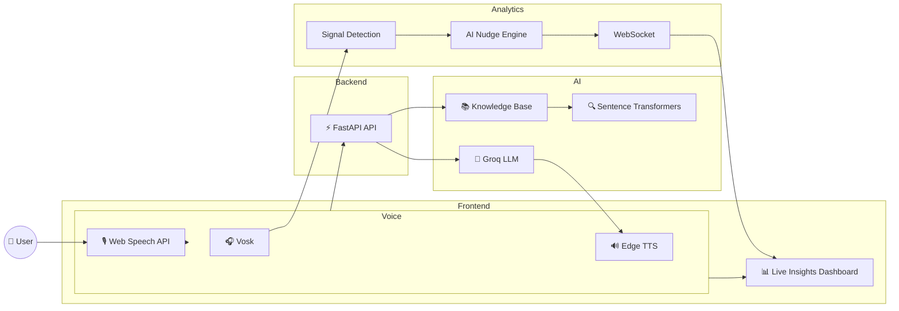

# 🎙️ VoxIntel AI

> **Knowledge-Grounded Voice Intelligence Platform**

VoxIntel AI is an AI-powered voice assistant platform built using FastAPI, Groq LLM, and Retrieval-Augmented Generation (RAG). It supports multilingual voice conversations, knowledge-grounded responses, and real-time conversational insights through an intuitive web interface.

---

## ✨ Features

- 🎤 AI-powered Voice Assistant
- 🧠 Knowledge-Grounded Responses (RAG)
- 🌍 Multilingual Voice Support
- 📚 Local Knowledge Base Retrieval
- ⚡ Real-Time Live Insights Dashboard
- 🔊 Text-to-Speech using Microsoft Edge TTS
- 🎧 Offline Speech Recognition using Vosk
- 🔄 WebSocket-based Live Updates
- 📱 Responsive Dark-Themed Interface

---


---

# 🏗️ Architecture



---

# 📂 Project Structure

```
voxintel-ai
│
├── docs/
│
├── VoiceAgent/
│   ├── api/
│   ├── vapi_config/
│   └── web_client/
│
├── KnowledgeBase/
│
├── Multilingual/
│   ├── philippines/
│   └── indonesia/
│
├── LiveInsights/
│
├── requirements.txt
├── .env.example
├── .gitignore
└── README.md
```

---

# ⚙️ Tech Stack

### Backend

- FastAPI
- Python
- WebSockets

### AI

- Groq LLM
- Sentence Transformers
- RAG Pipeline

### Speech

- Web Speech API
- Edge TTS
- Vosk

### Knowledge Base

- Chroma-style Vector Retrieval
- NumPy
- BeautifulSoup
- PDF Parsing

### Frontend

- HTML5
- CSS3
- JavaScript

---

# 🚀 Getting Started

## 1. Clone Repository

```bash
git clone https://github.com/<your-username>/voxintel-ai.git
cd voxintel-ai
```

---

## 2. Create Virtual Environment

Windows

```bash
python -m venv venv
venv\Scripts\activate
```

Linux / macOS

```bash
python3 -m venv venv
source venv/bin/activate
```

---

## 3. Install Dependencies

```bash
pip install -r requirements.txt
```

---

## 4. Configure Environment

Create a `.env` file using the provided `.env.example`.

Example:

```env
GROQ_API_KEY=your_api_key_here
HOST=0.0.0.0
PORT=8000
DEBUG=True
```

---

## 5. Start the Backend

```bash
uvicorn api.main:app --reload
```

---

## 6. Open the Frontend

Open:

```
VoiceAgent/web_client/index.html
```

or serve it using a local HTTP server.

---

# 📊 Modules

## 🎤 Q1 — Voice Agent

- AI-powered voice conversation
- Real-time speech recognition
- Text-to-speech responses
- Interactive voice interface

---

## 📚 Q2 — Knowledge Base

- Retrieval-Augmented Generation (RAG)
- Semantic search
- Vector-based retrieval
- Source-grounded responses

---

## 🌍 Q3 — Multilingual Voice Assistant

Supports localized voice interactions for:

- 🇵🇭 Philippines
- 🇮🇩 Indonesia

Features include:

- Localization
- Cultural adaptation
- Code-switching
- Market-specific prompts

---

## 📈 Q4 — Live Insights

- Real-time transcript
- AI-generated nudges
- Signal detection
- WebSocket dashboard
- Conversation monitoring

---

# 📌 Future Improvements

- User Authentication
- Voice Analytics
- Conversation History
- Multiple LLM Support
- Cloud Deployment
- Docker Support
- Admin Dashboard
- CI/CD Pipeline

---

# 🔒 Environment Variables

The project requires a `.env` file for API credentials.

A template is provided in `.env.example`.

Do **not** commit your `.env` file to GitHub.

---

# 🤝 Contributing

Contributions are welcome.

Feel free to open issues or submit pull requests to improve the project.

---

# 📄 License

This project is released under the **MIT License**.

---

# 👨‍💻 Author

**Shivansh Pandey**

- GitHub: https://github.com/shivansh1609
- LinkedIn: https://www.linkedin.com/in/shivanshupandey16/

---

⭐ If you found this project useful, consider giving it a star!
